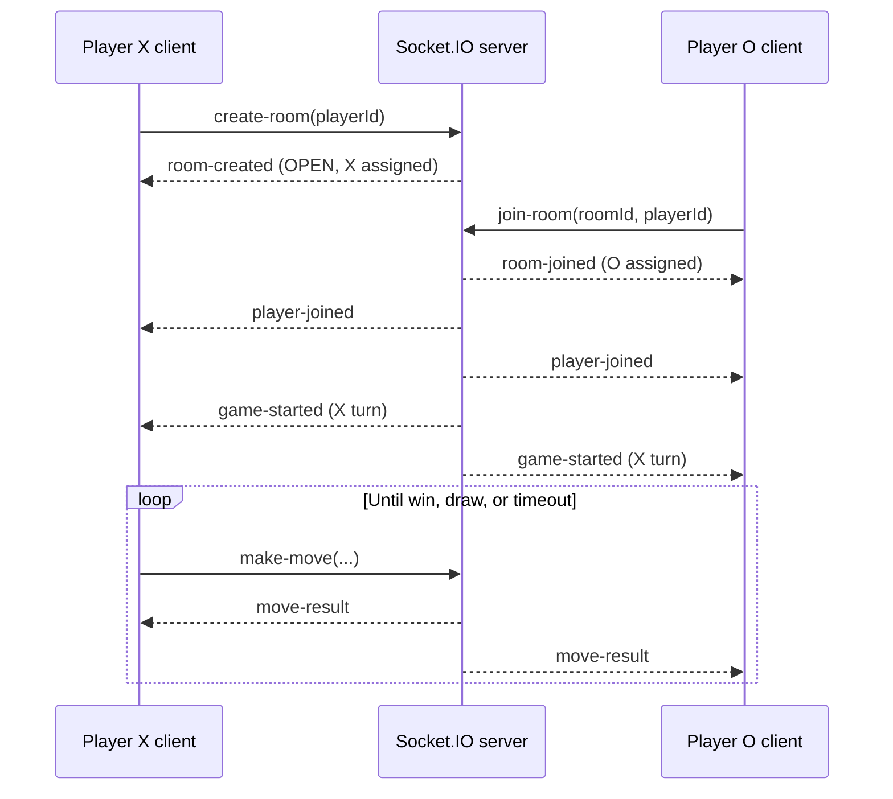

# Tic-Tac-Toe Multiplayer Backend API & Socket Event Documentation

> **Implementation contract — 21 July 2026.** This document is based on the running backend implementation. Events marked **Not implemented** are intentionally documented as unavailable; clients must not emit them or depend on them. No undocumented event or error shape is implied.

## Overview

### Architecture overview

The backend is a single Node.js process running Express for HTTP and Socket.IO for realtime messages. Socket event handlers call a `GameManager`, which coordinates an in-memory room manager and a Tic-Tac-Toe game engine. The game engine owns the board, move history, turn, deadline, winner, and draw state.

```text
Frontend ── HTTP ──> Express (/health, /rooms)
Frontend ─ Socket.IO -> Socket handlers -> GameManager -> RoomManager / GameEngine
                                                      └-> Socket.IO room broadcasts
```

All rooms, sessions, and timers are process-local. A server restart loses every room and game. The server supports exactly two players per room: the creator is X and the joiner is O.

### Socket.IO communication

Connect to the backend origin, normally `http://localhost:3000`. The server accepts WebSocket and Socket.IO polling. Game broadcasts are made to the Socket.IO room whose name is the `roomId`; therefore the sender also receives its own successful `move-result`.

There are no Socket.IO acknowledgement callbacks. Add event listeners before sending a request, and treat the corresponding server event as the response.

### Authentication and session management

**Authentication is not implemented.** There is no `authenticate` event, token, cookie session, or user account. The client supplies a stable `playerId`, and the server uses it as the player identity. This is suitable only for trusted/development clients: it is not authorization.

The server indexes each player ID and socket ID to a single in-memory room. Browser clients should persist their own `playerId` and `roomId` if they wish to reconnect. `socket.id` is transient and is never a client request field.

### Game lifecycle



Room status changes are `OPEN → ACTIVE → FINISHED`. A win, draw, or timeout finishes a room. Disconnecting does not pause a deadline, remove a player, or finish the game.

## Common payload reference

All examples are JSON. `turnDeadline` is an absolute Unix timestamp in milliseconds. ISO timestamps are UTC strings.

### `PlayerSummary`

```json
{
  "type": "object",
  "required": ["playerId", "symbol", "connected"],
  "properties": {
    "playerId": { "type": "string" },
    "symbol": { "type": "string", "enum": ["X", "O"] },
    "connected": { "type": "boolean" }
  },
  "additionalProperties": false
}
```

```json
{ "playerId": "player-alice", "symbol": "X", "connected": true }
```

### `Board`, `Move`, and `Error`

```json
{
  "Board": {
    "type": "array",
    "minItems": 3,
    "maxItems": 3,
    "items": {
      "type": "array",
      "minItems": 3,
      "maxItems": 3,
      "items": { "type": ["string", "null"], "enum": ["X", "O", null] }
    }
  },
  "Move": {
    "type": "object",
    "required": ["playerId", "row", "col", "timestamp"],
    "properties": {
      "playerId": { "type": "string" },
      "row": { "type": "integer", "minimum": 0, "maximum": 2 },
      "col": { "type": "integer", "minimum": 0, "maximum": 2 },
      "timestamp": { "type": "string", "format": "date-time" }
    }
  },
  "Error": {
    "type": "object",
    "required": ["message"],
    "properties": { "message": { "type": "string" } }
  }
}
```

The implemented error contract has only `message`. It does **not** contain `code`, `details`, or `recoverySuggestion`.

## Connection

### `connect`

| Field | Value |
|---|---|
| Purpose | Establish the Socket.IO transport. |
| Direction | Server → Client (native Socket.IO event) |
| Request | Socket.IO connection handshake; no application JSON payload. |
| Success response | Client receives a native `connect` event and can read `socket.id`. |
| Error response | Client receives native `connect_error` with an implementation/library error. |
| Validation rules | The connection origin must match `CLIENT_URL`; no application authentication occurs. |
| Notes | Do not send game actions until `socket.connected` is true. `socket.id` changes after reconnect. |

Example client connection:

```ts
const socket = io("http://localhost:3000", {
  transports: ["websocket", "polling"]
});
socket.on("connect", () => console.log(socket.id));
socket.on("connect_error", (error) => console.error(error.message));
```

Native success observation:

```json
{ "socketId": "Gf7U8_2aJ2bnxj5AAAAB" }
```

## Authentication

### `authenticate` — Not implemented

| Field | Value |
|---|---|
| Purpose | Authentication is not available in this backend. |
| Direction | N/A |
| Client request / schema | None. Do not emit `authenticate`. |
| Success response | None. |
| Error response | No application-level response is guaranteed for an unknown event. |
| Validation rules | None. |
| Notes | Supply `playerId` with room/game commands. It is an identity label, not proof of identity. |

## Room events

### `create-room`

| Field | Value |
|---|---|
| Purpose | Create an `OPEN` room and register the sender as Player X. |
| Direction | Client → Server |
| Success response | `room-created` to the initiating socket. |
| Error response | `error` to the initiating socket. |
| Validation rules | `playerId` and current socket must not already be indexed to a room. |
| Notes | The server generates a UUID v4 `roomId` and automatically joins the socket to that Socket.IO room. |

Request schema and example:

```json
{
  "type": "object",
  "required": ["playerId"],
  "properties": { "playerId": { "type": "string", "minLength": 1 } },
  "additionalProperties": false
}
```

```json
{ "playerId": "player-alice" }
```

`room-created` success schema and complete example:

```json
{
  "type": "object",
  "required": ["roomId", "player"],
  "properties": {
    "roomId": { "type": "string", "format": "uuid" },
    "player": { "$ref": "#/definitions/PlayerSummary" }
  }
}
```

```json
{
  "roomId": "3f1c2d52-2faa-4c36-a41f-5bd47b99c701",
  "player": { "playerId": "player-alice", "symbol": "X", "connected": true }
}
```

Error example:

```json
{ "message": "Player already in a room: player-alice" }
```

### `join-room`

| Field | Value |
|---|---|
| Purpose | Join an open room as Player O; this starts the match. |
| Direction | Client → Server |
| Success response | `room-joined` to joiner, then `player-joined` and `game-started` to the room. |
| Error response | `error` to the initiating socket. |
| Validation rules | Room must exist and contain fewer than two players; player ID/socket must not already be indexed; IDs cannot duplicate a room player. |
| Notes | The server assigns O. It initializes the board and first turn for X. |

Request schema and example:

```json
{
  "type": "object",
  "required": ["roomId", "playerId"],
  "properties": {
    "roomId": { "type": "string", "format": "uuid" },
    "playerId": { "type": "string", "minLength": 1 }
  },
  "additionalProperties": false
}
```

```json
{ "roomId": "3f1c2d52-2faa-4c36-a41f-5bd47b99c701", "playerId": "player-bob" }
```

Successful join (`room-joined`, joiner only):

```json
{
  "roomId": "3f1c2d52-2faa-4c36-a41f-5bd47b99c701",
  "player": { "playerId": "player-bob", "symbol": "O", "connected": true }
}
```

Room full error:

```json
{ "message": "Room is full: 3f1c2d52-2faa-4c36-a41f-5bd47b99c701" }
```

Room not found error:

```json
{ "message": "Room not found: 00000000-0000-0000-0000-000000000000" }
```

Already joined error:

```json
{ "message": "Player already in a room: player-bob" }
```

### `leave-room` — Not implemented

| Field | Value |
|---|---|
| Purpose | There is no public socket event to leave a room. |
| Direction | N/A |
| Request / response / errors | None. Do not emit this event. |
| Validation rules | None. |
| Notes | The domain class has an internal `leaveRoom` method, but it is not wired to a route or handler. Disconnect only marks a player offline. |

### `reconnect`

| Field | Value |
|---|---|
| Purpose | Bind a reconnecting socket to an existing in-memory player and recover the room state. |
| Direction | Client → Server |
| Success response | `room-state` to the new socket, then `player-reconnected` to the room. |
| Error response | `error` to the initiating socket. |
| Validation rules | `playerId` must remain indexed in an in-memory room. |
| Notes | Send after native Socket.IO `connect`; a restart makes recovery impossible. The deadline is not paused while disconnected. |

Request schema and example:

```json
{
  "type": "object",
  "required": ["playerId"],
  "properties": { "playerId": { "type": "string", "minLength": 1 } }
}
```

```json
{ "playerId": "player-bob" }
```

Error example:

```json
{ "message": "No active game found for reconnection" }
```

Reconnection sequence:

```mermaid
sequenceDiagram
  participant C as Reconnecting client
  participant S as Server
  participant R as Other player
  C->>S: native connect
  C->>S: reconnect { playerId }
  S->>S: replace socket ID; mark connected; join room
  S-->>C: room-state (full snapshot)
  S-->>C: player-reconnected
  S-->>R: player-reconnected
```

### `player-ready` — Not implemented

| Field | Value |
|---|---|
| Purpose | Readiness is not part of this game protocol. |
| Direction | N/A |
| Request / response / errors | None. |
| Validation rules | The game starts automatically when player two joins. |
| Notes | Do not emit this event. |

## Match events

### `game-started`

| Field | Value |
|---|---|
| Purpose | Announce that a second player joined and the game is now active. |
| Direction | Server → Client (room broadcast) |
| Description | Supplies the empty board, both players, the current player (always X), and first deadline. |
| Client request / error response | None; server-originated event. |
| Validation rules | Sent only after a successful second-player join. |
| Notes | This is the implemented equivalent of a `GAME_START` event. |

Payload schema and example:

```json
{
  "type": "object",
  "required": ["board", "currentPlayer", "turnDeadline", "playerX", "playerO"],
  "properties": {
    "board": { "$ref": "#/definitions/Board" },
    "currentPlayer": { "$ref": "#/definitions/PlayerSummary" },
    "turnDeadline": { "type": "integer" },
    "playerX": { "$ref": "#/definitions/PlayerSummary" },
    "playerO": { "$ref": "#/definitions/PlayerSummary" }
  }
}
```

```json
{
  "board": [[null, null, null], [null, null, null], [null, null, null]],
  "currentPlayer": { "playerId": "player-alice", "symbol": "X", "connected": true },
  "turnDeadline": 1784635230000,
  "playerX": { "playerId": "player-alice", "symbol": "X", "connected": true },
  "playerO": { "playerId": "player-bob", "symbol": "O", "connected": true }
}
```

### `turn-started` — Not implemented

No separate `turn-started` event exists. Use `game-started` for the first turn and a successful non-final `move-result` for each later turn. `remainingTime` is not sent; calculate it as `turnDeadline - Date.now()`. `expiresAt` is represented by `turnDeadline`.

### `make-move`

| Field | Value |
|---|---|
| Purpose | Ask the server to place the current player's mark in a board cell. |
| Direction | Client → Server |
| Success response | `move-result` broadcast to the room. |
| Error response | A failed `move-result` broadcast to the room. |
| Validation rules | Game must be active; row/col must be 0–2; target must be empty; supplied `playerId` must be current player; game cannot be over. |
| Notes | Never optimistically commit the board. Update from server `move-result`. |

Request schema and example:

```json
{
  "type": "object",
  "required": ["roomId", "playerId", "row", "col"],
  "properties": {
    "roomId": { "type": "string" },
    "playerId": { "type": "string" },
    "row": { "type": "integer", "minimum": 0, "maximum": 2 },
    "col": { "type": "integer", "minimum": 0, "maximum": 2 }
  },
  "additionalProperties": false
}
```

```json
{
  "roomId": "3f1c2d52-2faa-4c36-a41f-5bd47b99c701",
  "playerId": "player-alice",
  "row": 0,
  "col": 0
}
```

Invalid position response:

```json
{
  "success": false,
  "error": "Position (3, 0) is out of bounds",
  "board": [[null, null, null], [null, null, null], [null, null, null]],
  "currentPlayer": { "playerId": "player-alice", "symbol": "X", "connected": true },
  "turnDeadline": 1784635230000,
  "winner": null,
  "isDraw": false
}
```

Cell occupied response uses the same shape, for example `{ "success": false, "error": "Cell (0, 0) is already occupied", ... }`. A wrong turn produces `It is not your turn`; a finished game produces `Game is already over` or `Game is not active`.

### `move-result`

| Field | Value |
|---|---|
| Purpose | Provide the authoritative outcome of a move request or timeout. |
| Direction | Server → Client (room broadcast) |
| Description | Contains a full board and the next turn or terminal state. |
| Client request | None; received after `make-move` or server timeout. |
| Error response | `success: false` with an `error` message. |
| Validation rules | Server-generated only. |
| Notes | `move` has no `symbol` field. There is no move-number field; derive it from `moves.length` only in a `room-state` snapshot. |

Success schema:

```json
{
  "type": "object",
  "required": ["success", "board", "currentPlayer", "winner", "isDraw"],
  "properties": {
    "success": { "const": true },
    "move": { "$ref": "#/definitions/Move" },
    "board": { "$ref": "#/definitions/Board" },
    "currentPlayer": { "oneOf": [{ "$ref": "#/definitions/PlayerSummary" }, { "type": "null" }] },
    "turnDeadline": { "type": ["integer", "null"] },
    "winner": { "oneOf": [{ "$ref": "#/definitions/PlayerSummary" }, { "type": "null" }] },
    "winningCells": { "type": ["array", "null"] },
    "isDraw": { "type": "boolean" },
    "timeoutWin": { "type": "boolean" }
  }
}
```

Normal updated-board response:

```json
{
  "success": true,
  "move": { "playerId": "player-alice", "row": 0, "col": 0, "timestamp": "2026-07-21T12:00:05.000Z" },
  "board": [["X", null, null], [null, null, null], [null, null, null]],
  "currentPlayer": { "playerId": "player-bob", "symbol": "O", "connected": true },
  "turnDeadline": 1784635260000,
  "winner": null,
  "isDraw": false
}
```

### `turn-timeout` — Not implemented as a separate event

The server represents a timed-out turn with `move-result`, `winner`, `currentPlayer: null`, `turnDeadline: null`, and normally `timeoutWin: true`. It does not send a `loser` or `reason` field.

```json
{
  "success": true,
  "board": [["X", null, null], [null, null, null], [null, null, null]],
  "winner": { "playerId": "player-bob", "symbol": "O", "connected": true },
  "winningCells": null,
  "isDraw": false,
  "currentPlayer": null,
  "turnDeadline": null,
  "timeoutWin": true
}
```

### `game-over` — Not implemented as a separate event

Terminal outcomes are represented by `move-result`:

| Outcome | `winner` | `isDraw` | Other fields |
|---|---|---|---|
| Player X wins | X player summary | `false` | `winningCells` contains three cells; current player/deadline are `null`. |
| Player O wins | O player summary | `false` | Same terminal shape. |
| Draw | `null` | `true` | `winningCells`, current player, and deadline are `null`. |
| Timeout | Opponent player summary | `false` | `timeoutWin: true` on scheduled path. |
| Opponent left | Not implemented | Not implemented | Disconnect only sends `player-disconnected`; no forfeit occurs. |

Winning example:

```json
{
  "success": true,
  "move": { "playerId": "player-alice", "row": 0, "col": 2, "timestamp": "2026-07-21T12:00:23.000Z" },
  "board": [["X", "X", "X"], ["O", "O", null], [null, null, null]],
  "currentPlayer": null,
  "turnDeadline": null,
  "winner": { "playerId": "player-alice", "symbol": "X", "connected": true },
  "winningCells": [[0, 0], [0, 1], [0, 2]],
  "isDraw": false
}
```

## Reconnection events

### `player-disconnected`

| Field | Value |
|---|---|
| Purpose | Notify room members that a known player disconnected. |
| Direction | Server → Client (room broadcast) |
| Client request / success / error response | None; server-generated native-disconnect consequence. |
| Validation rules | Sent only when the departing socket maps to a room player. |
| Notes | The player remains in the room, and their deadline continues. |

Schema and example:

```json
{
  "type": "object",
  "required": ["playerId"],
  "properties": { "playerId": { "type": "string" } }
}
```

```json
{ "playerId": "player-bob" }
```

### `player-reconnected`

| Field | Value |
|---|---|
| Purpose | Notify room members that a player has a new connected socket. |
| Direction | Server → Client (room broadcast) |
| Client request / success / error response | Generated after successful custom `reconnect`. |
| Validation rules | Player must be recoverable by `playerId`. |
| Notes | The reconnecting socket also receives this broadcast. |

```json
{ "playerId": "player-bob" }
```

### `room-recovered` and `game-resync` — Not implemented

The implemented recovery/resync event is `room-state`, sent only to the reconnecting socket. It is the complete state replacement payload:

```json
{
  "roomId": "3f1c2d52-2faa-4c36-a41f-5bd47b99c701",
  "status": "ACTIVE",
  "players": [
    { "playerId": "player-alice", "symbol": "X", "connected": true },
    { "playerId": "player-bob", "symbol": "O", "connected": true }
  ],
  "board": [["X", null, null], [null, "O", null], [null, null, null]],
  "currentPlayer": { "playerId": "player-alice", "symbol": "X", "connected": true },
  "turnDeadline": 1784635260000,
  "winner": null,
  "winningCells": null,
  "isDraw": false,
  "moves": [
    { "playerId": "player-alice", "row": 0, "col": 0, "timestamp": "2026-07-21T12:00:05.000Z" },
    { "playerId": "player-bob", "row": 1, "col": 1, "timestamp": "2026-07-21T12:00:11.000Z" }
  ]
}
```

`room-state` schema: `roomId` (string), `status` (`OPEN`, `ACTIVE`, or `FINISHED`), `players` (array of `PlayerSummary`), `board`, nullable `currentPlayer`, nullable `turnDeadline`, nullable `winner`, nullable `winningCells`, boolean `isDraw`, and array `moves`.

## Error events

### `error`

| Field | Value |
|---|---|
| Purpose | Report failures from `create-room`, `join-room`, and `reconnect`. |
| Direction | Server → Client (initiating socket) |
| Description | A single human-readable message. |
| Client request | None. |
| Validation rules | Server-generated after handler/domain failure. |
| Notes | Move failures use `move-result` instead. |

Schema, response, and recovery:

```json
{
  "type": "object",
  "required": ["message"],
  "properties": { "message": { "type": "string" } },
  "additionalProperties": false
}
```

```json
{ "message": "Room not found: unknown-room" }
```

Use the message for display/logging and let the user choose a valid room or create a new one. There are no structured `code`, `details`, or recovery-suggestion fields.

| Requested error category | Implemented behavior |
|---|---|
| Generic error | `error: { message }` for handler failures. |
| Validation error | No typed validation-error event; known room failures use `error`, move failures use failed `move-result`. |
| Room error | Message examples: room not found, full, player already in room. |
| Game error | Failed `move-result` with `error`: wrong turn, occupied cell, invalid position, inactive/finished game. |
| Authentication error | Not available; authentication is not implemented. |
| Internal server error | No stable Socket.IO error code/schema. REST middleware returns HTTP 500 `{ "error": "..." }` for unhandled route errors. |

## Heartbeat

### `ping` / `pong` — No application events

The backend does not expose custom JSON `PING` or `PONG` socket events. Socket.IO itself maintains transport heartbeats internally. Clients should use native `connect`, `disconnect`, and `connect_error` callbacks; do not emit application `ping`/`pong` commands.

## HTTP API

### `GET /health`

| Field | Value |
|---|---|
| Purpose | Liveness check. |
| Direction | Client → Server over HTTP; Server → Client JSON response. |
| Request schema | No request body. |
| Success response | HTTP 200. |
| Error response | HTTP 404 only for a wrong path. |
| Validation rules | None. |
| Notes | Does not test room state or dependencies. |

```json
{ "status": "ok", "server": "running" }
```

### `GET /rooms`

| Field | Value |
|---|---|
| Purpose | List rooms available to join. |
| Direction | Client → Server over HTTP; Server → Client JSON response. |
| Request schema | No request body. |
| Success response | HTTP 200 array of `OPEN` room summaries. |
| Error response | Standard HTTP error only. |
| Validation rules | None. |
| Notes | Active and finished rooms are excluded. |

```json
[
  {
    "roomId": "3f1c2d52-2faa-4c36-a41f-5bd47b99c701",
    "status": "OPEN",
    "playerCount": 1,
    "players": [{ "playerId": "player-alice", "symbol": "X", "connected": true }],
    "createdAt": "2026-07-21T12:00:00.000Z",
    "updatedAt": "2026-07-21T12:00:00.000Z"
  }
]
```

### `GET /rooms/:id`

| Field | Value |
|---|---|
| Purpose | Read a full room/game snapshot. |
| Direction | Client → Server over HTTP; Server → Client JSON response. |
| Request schema | Path parameter `id`: string room ID; no body. |
| Success response | HTTP 200 room object. |
| Error response | HTTP 404 `{ "error": "Room not found: <id>" }`. |
| Validation rules | Room must exist in the current process. |
| Notes | This is a read endpoint, not a socket resync replacement; it exposes no socket IDs. |

The `game` object contains `board`, nullable `currentPlayer`, nullable `turnDeadline`, nullable `winner`, nullable `winningCells`, `isDraw`, complete `moves`, nullable `startedAt`, and nullable `completedAt`. See `room-state` for full nested examples; the REST response additionally includes `createdAt` and `updatedAt`.

### `POST /rooms`

| Field | Value |
|---|---|
| Purpose | Not implemented. |
| Direction | Client → Server over HTTP; Server → Client JSON response. |
| Request schema | No accepted schema. |
| Success response | None. |
| Error response | HTTP 501. |
| Validation rules | None. |
| Notes | Create rooms with `create-room`. |

```json
{ "error": "Not implemented" }
```

## Frontend integration checklist

1. Establish a Socket.IO connection and store a stable client-generated `playerId`.
2. Create a room or fetch `GET /rooms` and emit `join-room` with a selected ID.
3. Persist the `roomId` and assigned `symbol` from `room-created`/`room-joined`.
4. Replace local board/turn state from `game-started`, `move-result`, and especially `room-state`—the server is authoritative.
5. Enable input only if `currentPlayer.playerId === localPlayerId` and the target board cell is `null`.
6. Drive the timer from `turnDeadline`; clear it for draws or when `currentPlayer` is null.
7. After a native reconnect, emit custom `reconnect` with the saved `playerId`, then replace state from `room-state`.

## Contract limitations

- Inputs are not runtime schema-validated, despite the schemas above describing the required integration shape.
- The `playerId` is not authenticated, and current move authorization does not bind a supplied player ID to the emitting socket. Do not expose this protocol directly to untrusted clients without authentication/authorization.
- The source TypeScript event declarations currently omit emitted `room-joined`, declare a move `symbol` that is not emitted, and omit optional scheduled-timeout `timeoutWin`. This document describes actual runtime messages.
