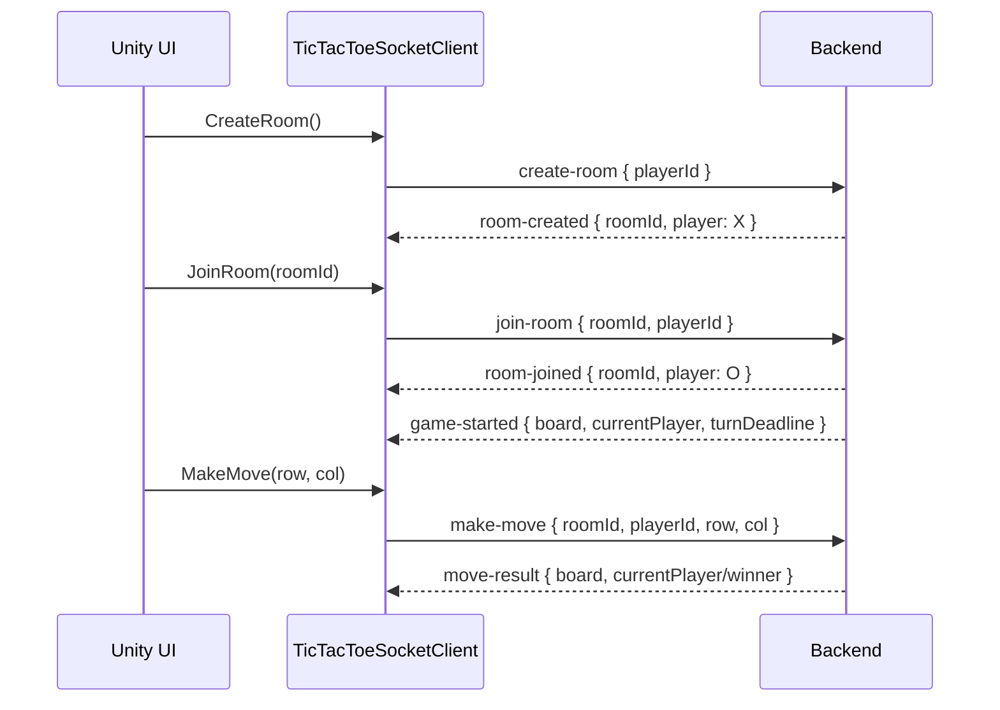

# Unity workflow for the Tic-Tac-Toe backend

## 1. Install dependencies

The backend is Socket.IO v4, not a plain WebSocket server. Install a compatible Unity Socket.IO client.

1. In Unity, open **Window → Package Manager → + → Add package from git URL**.
2. Add `https://github.com/itisnajim/SocketIOUnity.git`.
3. Install Unity's Newtonsoft package with Package Manager (`com.unity.nuget.newtonsoft-json`) if it is not already installed. The supplied scripts use it for reliable JSON serialization, including IL2CPP builds.
4. Copy the `unityScripts/Runtime` files into the Unity project's `Assets/Scripts/TicTacToeMultiplayer/` folder, or reference this folder from an assembly definition.

`SocketIOUnity` supports Socket.IO v4 and exposes `OnUnityThread`, which is used by the client class so UI and GameObject changes occur on Unity's main thread. Keep the socket manager alive between scenes.

## 2. Run the backend and choose the correct URL

Start the backend:

```bash
cd backend
npm install
npm run dev
```

| Unity target | `serverUrl` example |
|---|---|
| Editor on the same computer as the backend | `http://localhost:3000` |
| Android/iOS device on the same Wi-Fi | `http://192.168.1.10:3000` (replace with the computer's LAN address) |
| Android emulator | Usually `http://10.0.2.2:3000` |
| Production | `https://api.example.com` behind TLS/reverse proxy |

Do not use `localhost` on a physical phone: it points to the phone itself. A browser/WebGL client also needs the backend `CLIENT_URL` CORS configuration to permit the hosted game's origin. Mobile operating systems may block unencrypted HTTP in production; use HTTPS/WSS or configure development network security accordingly.

## 3. Add the socket manager

1. Create an empty GameObject named `NetworkManager` in your boot scene.
2. Add `TicTacToeSocketClient`.
3. Set **Server Url** in the Inspector.
4. It creates/persists a player UUID in `PlayerPrefs`, connects in `Awake`, and survives scene changes.

Subscribe from a presenter/controller script:

```csharp
using TicTacToeMultiplayer;
using UnityEngine;

public sealed class GamePresenter : MonoBehaviour
{
    [SerializeField] private TicTacToeSocketClient network;

    private void OnEnable()
    {
        network.RoomCreated += OnRoomCreated;
        network.RoomJoined += OnRoomJoined;
        network.GameStarted += OnGameStarted;
        network.MoveResult += OnMoveResult;
        network.RoomStateReceived += OnRoomState;
        network.ServerError += OnServerError;
    }

    private void OnDisable()
    {
        network.RoomCreated -= OnRoomCreated;
        network.RoomJoined -= OnRoomJoined;
        network.GameStarted -= OnGameStarted;
        network.MoveResult -= OnMoveResult;
        network.RoomStateReceived -= OnRoomState;
        network.ServerError -= OnServerError;
    }

    public void CreateButtonPressed() => network.CreateRoom();
    public void JoinButtonPressed(string roomId) => network.JoinRoom(roomId);
    public void CellPressed(int row, int col) => network.MakeMove(row, col);

    private void OnRoomCreated(RoomCreatedPayload data) { /* show room ID and X symbol */ }
    private void OnRoomJoined(RoomJoinedPayload data) { /* show room ID and O symbol */ }
    private void OnGameStarted(GameStartedPayload data) { Render(data.Board); }
    private void OnMoveResult(MoveResultPayload data) { if (data.Success) Render(data.Board); }
    private void OnRoomState(RoomStatePayload data) { Render(data.Board); }
    private void OnServerError(ErrorPayload data) { Debug.LogError(data.Message); }
    private void Render(string[][] board) { /* map board[row][col] to the nine UI buttons */ }
}
```

## 4. Normal game flow



Use these UI rules:

1. Save/display the room ID received from `RoomCreated` or `RoomJoined`.
2. Render only backend-sent boards. Do not permanently update a cell immediately after a click.
3. Enable a cell only when the game is active, the cell is `null`, and `currentPlayer.PlayerId == network.PlayerId`.
4. Convert a deadline to a countdown with `Math.Max(0, payload.TurnDeadline.Value - DateTimeOffset.UtcNow.ToUnixTimeMilliseconds())`.
5. When `Winner` is non-null or `IsDraw` is true, disable the board. `CurrentPlayer` and `TurnDeadline` are then null.
6. On `MoveResult.Success == false`, show `Error`; retain/re-render the included authoritative board rather than applying the click locally.

## 5. Reconnection workflow

The Socket.IO transport reconnect and the game's identity recovery are separate actions. After native reconnection, call `RecoverRoom()`:

```csharp
private void HandleTransportConnected()
{
    // Call only if the player had previously created/joined a game.
    network.RecoverRoom();
}
```

The server responds with `room-state`, which must replace local board, players, winner/draw state, and deadline. Then it broadcasts `player-reconnected`. If the backend was restarted or does not know the saved player ID, it sends `error: { message: "No active game found for reconnection" }`; return the player to the lobby.

Important: a disconnected player's turn timer continues. The backend does not pause, forfeit, or delete a player on disconnect.

## 6. REST lobby usage

Use REST only for read views such as a room browser. Room creation and joining are Socket.IO actions.

```csharp
var api = new TicTacToeRestClient("http://192.168.1.10:3000");
var health = await api.GetHealthAsync();
var rooms = await api.GetOpenRoomsAsync();

foreach (var room in rooms)
{
    Debug.Log($"{room.RoomId}: {room.PlayerCount}/2");
}
```

- `GET /health` returns server liveness.
- `GET /rooms` returns `OPEN` rooms only.
- `GET /rooms/:id` returns a full snapshot.
- `POST /rooms` is currently HTTP 501; call `CreateRoom()` over Socket.IO instead.

Catch `TicTacToeApiException` to inspect `StatusCode` and the backend's error message.

## 7. Implemented protocol only

Do not send these event names: `authenticate`, `leave-room`, `player-ready`, `turn-started`, `turn-timeout`, `game-over`, `room-recovered`, `game-resync`, `ping`, or `pong`. They are not implemented by this backend.

The backend has no authentication. `playerId` is client-supplied and should be treated as development-only identity; do not rely on it for production authorization. For the authoritative event/payload reference, see [`doc/back-architecture/api-socket-events.md`](../../doc/back-architecture/api-socket-events.md).
